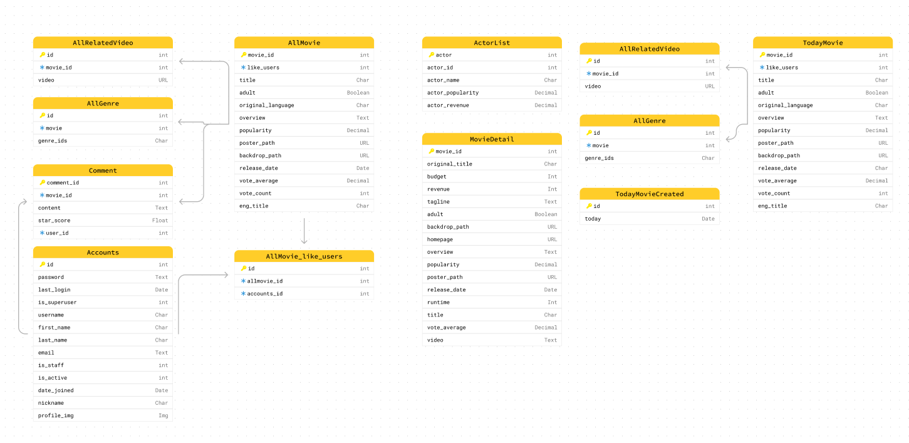

# final_pjt

## 

## ER Diagram

## 주요 기능 및 알고리즘

#### 1. 영화 추천 알고리즘

- Vue에서 선택된 영화(Detail or like) 데이터를 Django로 넘겨준다.

- 영화의 줄거리를 TF-IDF (Term Frequency-Inverse Document Frequency) 알고리즘을 활용하여 단어의 빈도와 역 문서의 빈도를 분석하여 각 단어들마다 중요한 정도에 따라 가중치를 부여하는 matrix를 만든다.

- 부여된 가중치를 기반으로 줄거리들의 cosine similarity matrix를 만들고 Vue에서 받은 데이터에 대하여 유사도가 가장 높은 상위 10개의 영화를 추천한다.

- like의 경우 여러 list형태로 다양한 영화를 제공하기 때문에 overview를 합쳐 TF-IDF와 cosine similarity를 활용하여 유사도가 높은 영화중 랜덤한 10개를 추천한다.

#### 2.  매출(revenue) 예측 알고리즘

- Vue에서 선택된 배우 데이터를 Django로 넘겨준다.

- 선택된 배우들이 참여한 영화 데이터를 기반으로 배우 별 revenue와 popularity 데이터를 생성한다.

- revenue에 popularity를 활용하여 가중 평균(Weighted Mean)으로 매출액을 예측한다.

#### 3. Best Movie

- TMDB에서 제공하는 popularity를 기반으로 가장 인기있는 10개의 영화를 추천한다.

#### 4. 영화 검색

- 검색창에 입력한 데이터를 v-model로 받아 TMDB의 API에 보내면 입력한 데이터가 포함된 모든 영화를 응답받아 포스터를 출력한다.

- 포스터를 누를 시 DB에서 해당 영화를 가져와 Detail을 출력한다.

## 